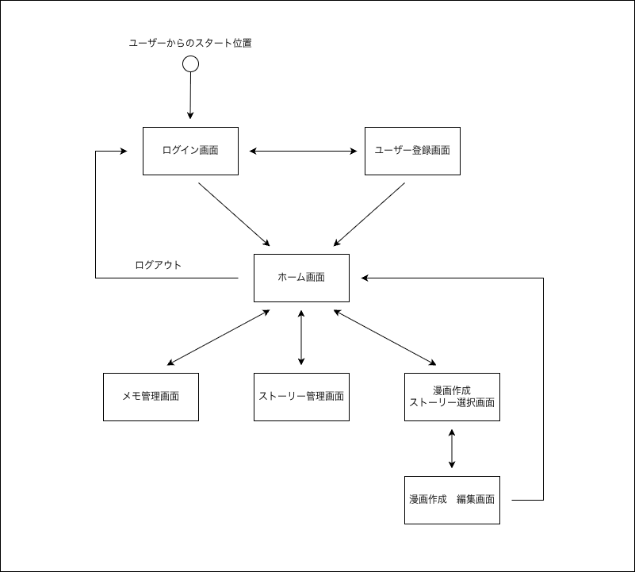
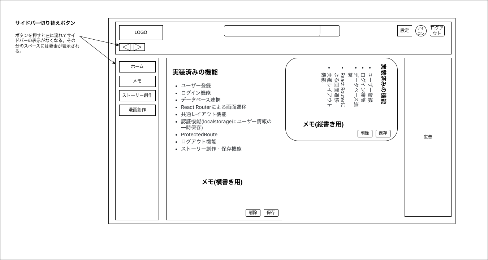
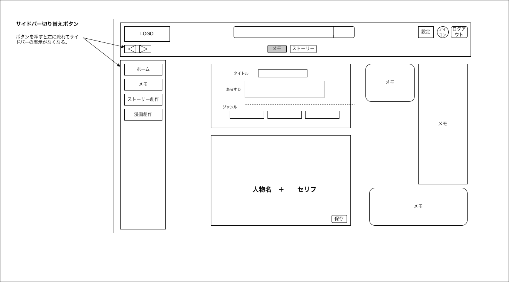
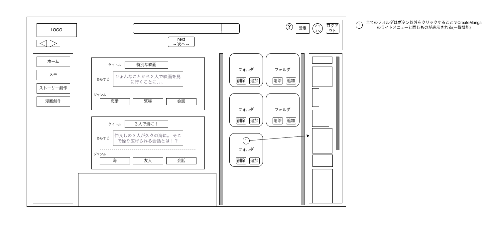

# 画面設計

> 01-requirements（要件定義）の内容をもとに、ユーザーが実際に操作する画面の構成・遷移・レイアウト・挙動を定義する工程。
> ここでの成果物（画面一覧・画面遷移図・ワイヤーフレーム・画面仕様書）は、03-system-design以降の設計のインプットとなる。

---

## 1. フォルダ構成

| パス | 内容 |
|---|---|
| [README.md](README.md) | このファイル。02フォルダ全体の概要 |
| [screen-list.md](screen-list.md) | 画面一覧表（画面ID・画面名・概要） |
| [screen-flow/](screen-flow/) | 画面遷移図（drawio形式＋画像） |
| [wireframes/](wireframes/) | 各画面のワイヤーフレーム（drawio形式＋画像） |
| [specifications/](specifications/) | 各画面の詳細仕様書（Markdown） |

---

## 2. 画面遷移図

- ログイン画面・ユーザー登録画面が起点。ログイン後はホーム画面を経由して各機能画面へ遷移する。
- 漫画作成は「ストーリー選択画面 → 編集画面」の2ステップ構成。
- どの画面からもログアウトでログイン画面に戻る。

---

## 3. 画面一覧

全7画面。詳細は[screen-list.md](screen-list.md)、各画面の仕様は下表からワイヤーフレーム・仕様書にリンクしている。

| No | 画面ID | 画面名 | 概要 | ワイヤーフレーム | 仕様書 |
|----|-------|--------|------|------|------|
| 01 | SCR-001 | ログイン画面 | ユーザー認証を行う | [Login.drawio](wireframes/Login.drawio.png) | [Login.md](specifications/Login.md) |
| 02 | SCR-002 | ユーザー登録画面 | アカウントの新規登録（招待コード制）を行う | [Register.drawio](wireframes/Register.drawio.png) | [Register.md](specifications/Register.md) |
| 03 | SCR-003 | ホーム画面 | メモ・ストーリー・漫画を一覧表示する | [Home.drawio](wireframes/Home.drawio.png) | [Home.md](specifications/Home.md) |
| 04 | SCR-004 | メモ管理画面 | メモの作成・編集・削除を行う | [Memo.drawio](wireframes/Memo.drawio.png) | [Memo.md](specifications/Memo.md) |
| 05 | SCR-005 | ストーリー管理画面 | あらすじ・ジャンル・セリフ台本の作成を行う | [StoryCreate.drawio](wireframes/StoryCreate.drawio.png) | [StoryCreate.md](specifications/StoryCreate.md) |
| 06 | SCR-006 | 漫画作成 - ストーリー選択画面 | 漫画化するストーリーと素材フォルダを選択する | [TopicChoice2.drawio](wireframes/TopicChoice2.drawio.png) | [TopicChoice.md](specifications/TopicChoice.md) |
| 07 | SCR-007 | 漫画作成 - 編集画面 | イラスト素材を配置し、漫画のコマを作成する | [CreateManga.drawio](wireframes/CreateManga.drawio.png) | [CreateManga.md](specifications/CreateManga.md) |

---

## 4. ワイヤーフレーム一覧

<table>
<tr>
<td width="50%">

**SCR-001 ログイン画面**

</td>
<td width="50%">

**SCR-002 ユーザー登録画面**

</td>
</tr>
<tr>
<td width="50%">

**SCR-003 ホーム画面**

</td>
<td width="50%">

**SCR-004 メモ管理画面**

</td>
</tr>
<tr>
<td width="50%">

**SCR-005 ストーリー管理画面**

</td>
<td width="50%">

**SCR-006 漫画作成 - ストーリー選択画面**

</td>
</tr>
<tr>
<td width="50%">

**SCR-007 漫画作成 - 編集画面**

</td>
<td width="50%">

</td>
</tr>
</table>

---

## 5. 共通レイアウトルール

各画面の仕様書に個別に記載しているが、認証後の画面（SCR-003〜SCR-007）に共通する要素は以下のとおり。個別画面の仕様変更時は、この共通ルールとの整合性も確認すること。

| 要素 | 内容 |
|---|---|
| ヘッダー | サービスロゴ、検索バー、設定ボタン、アカウントボタン、ログアウトボタンを共通で表示 |
| サイドメニュー | ホーム／メモ／ストーリー創作／漫画創作への遷移ボタンを表示。サイドバー切り替えボタンで表示・非表示を切り替え可能（SCR-007編集画面のみ挙動が異なる可能性あり。[TopicChoice.md](specifications/TopicChoice.md)・[CreateManga.md](specifications/CreateManga.md)の備考を参照） |
| ログアウト | どの画面からもログイン画面へ遷移する |

---

## 6. 命名規則

| 対象 | 規則 | 例 |
|---|---|---|
| wireframes配下 | 画面の英語名（PascalCase） | `Login.drawio` / `TopicChoice.drawio` |
| specifications配下 | 対応するワイヤーフレームと同名（末尾の改訂番号は付けない） | `Login.md` / `TopicChoice.md` |

新しい画面を追加する場合も、ワイヤーフレームとその仕様書のファイル名（拡張子を除く）を一致させる。

**改訂版のファイル名について**：ワイヤーフレームを修正した場合、元のファイルは上書きせず末尾に連番（`2`, `3`…）を付けて別ファイルとして保存する運用になっている（例：`TopicChoice.drawio.png` → `TopicChoice2.drawio.png`）。**同じ名前で番号違いのファイルが複数存在する場合、番号が最大のものが常に最新かつ正式版**。番号なし（無印）が最も古い版になる。本READMEおよび各仕様書からは、その時点での最新版（最大番号のファイル）にリンクする。

---

## 7. 申し送り事項・未確定事項

現時点で仕様が固まっていない、または対応を保留している事項。03-system-design以降で扱うか、対応方針を決めるまではこのまま保留とする。

- **設定画面・アカウント情報編集画面が未定義**：ヘッダーの設定ボタン／アカウントボタンから遷移する想定だが、画面自体は[screen-list.md](screen-list.md)に未掲載。対応保留中。
- **イラスト素材のアップロードUIは作らない方針**：素材フォルダへの画像追加は、専用画面を用意せずOS標準のファイル選択ダイアログに委ねる。そのため[screen-list.md](screen-list.md)にアップロード専用画面は存在しない（意図的な設計判断）。
- **メモ管理画面とストーリー管理画面の直接遷移**：ワイヤーフレーム（StoryCreate）のヘッダーには両画面を直接切り替えるボタンがあるが、画面遷移図（screen-flow2.drawio）ではホーム画面経由の遷移としてのみ表現されている。どちらが正か要確認。

---

## 作成情報

| 項目 | 内容 |
|------|------|
| 工程名 | 画面設計 |
| 対象画面数 | 7画面 |
| 最終更新日 | 2026-08-17 |
| 更新者 | Ren Nakamoto |
