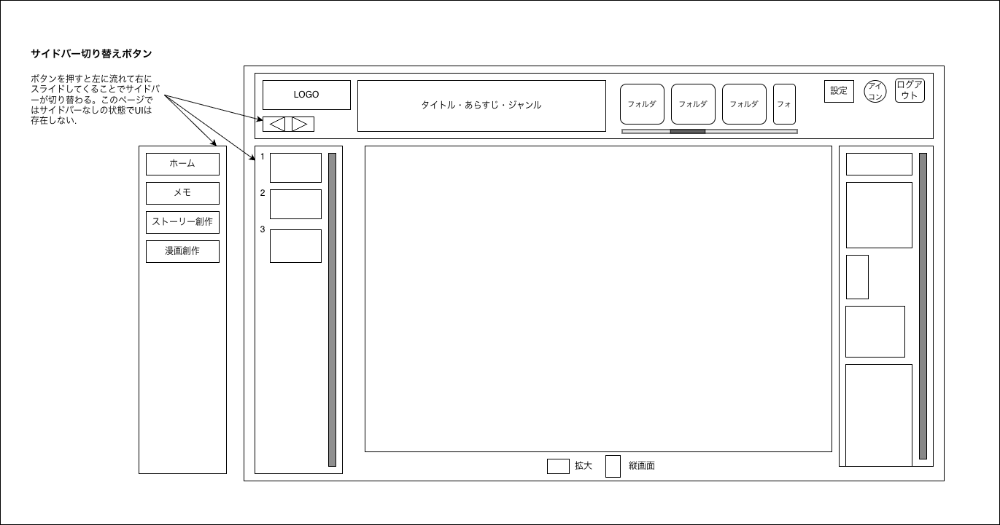

# 漫画作成 - 編集画面

---

## 1. 画面概要

選択したストーリーとイラスト素材フォルダをもとに、ページ（コマ）単位でイラスト素材を配置し、漫画の原稿を作成する画面。

---

## 2. 画面情報

| 項目 | 内容 |
|------|------|
| 画面ID | SCR-007 |
| 画面名 | 漫画作成 - 編集画面 |
| URL | /manga/edit |
| 権限 | ログインユーザー |
| 遷移元 | 漫画作成 - ストーリー選択画面 |
| 遷移先 | ホーム画面、メモ管理画面、ストーリー管理画面、漫画作成 - ストーリー選択画面、設定画面、アカウント情報編集画面、ログイン画面（ログアウト時） |

---

## 3. 画面レイアウト

| No | 項目 | 説明 |
|----|------|------|
| 1 | ヘッダー | サービス名ロゴ、サイドバー切り替えボタン、選択中ストーリーの情報（タイトル・あらすじ・ジャンル）、素材フォルダタブ、設定ボタン、アカウントボタン、ログアウトボタンを表示 |
| 2 | サイドメニュー | 各画面へ遷移するためのボタンを表示 |
| 3 | ページ（コマ）一覧 | 作成中の漫画のページをサムネイルで一覧表示し、縦スクロールで選択できる |
| 4 | 編集キャンバス | 選択中のページに対してイラスト素材を配置し、コマを作成するメイン編集エリア |
| 5 | 素材一覧 | 選択中のフォルダに含まれるイラスト素材をサムネイルで一覧表示し、縦スクロールで選択できる |
| 6 | 表示設定 | 拡大表示・縦画面表示を切り替えるボタンを表示 |

---

## 4. 操作

| 操作 | 動作 |
|------|------|
| サイドバー切り替えボタンをクリック | サイドメニューの表示位置を切り替える |
| 素材フォルダタブをクリック | 素材一覧に表示するフォルダを切り替える |
| ページ（コマ）サムネイルをクリック | 編集キャンバスに表示するページを切り替える |
| 素材サムネイルをキャンバスへドラッグ&ドロップ | 選択した素材をキャンバス上の任意の位置に配置する |
| 拡大ボタンをクリック | 編集キャンバスを拡大表示する |
| 縦画面ボタンをクリック | 編集キャンバスを縦画面表示に切り替える |
| 設定をクリック | 設定編集画面を開く |
| アカウントアイコンをクリック | アカウント情報編集画面を開く |
| ログアウトをクリック | ログイン画面へ遷移する |

---

## 5. 表示内容

- ページ（コマ）は作成順に表示する。
- 素材は選択中フォルダ内の登録順で表示する。
- 選択中ストーリーの情報（タイトル・あらすじ・ジャンル）はヘッダーに常時表示する。

---

## 6. エラー

- 素材の配置に失敗した場合はエラーメッセージを表示する。
- 保存に失敗した場合はエラーメッセージを表示する。

---

## 7. 備考

- 保存ボタンの配置・自動保存の要否はワイヤーフレーム上に明示されていないため、詳細設計時に別途確定する。
- サイドバー切り替えボタンの挙動について、ワイヤーフレームの注記では「このページではサイドバーなしの状態でUIは存在しない」とあり、他画面（表示・非表示の単純な切り替え）と異なる可能性があるため、詳細設計時に別途確認する。
- ページ（コマ）の追加・削除・並び替え操作はワイヤーフレーム上に明示されていないため、別途確定する。
- コマ内でのセリフ表示・配置方法（ストーリー管理画面で作成したセリフとの連携方法）は別途確定する。
