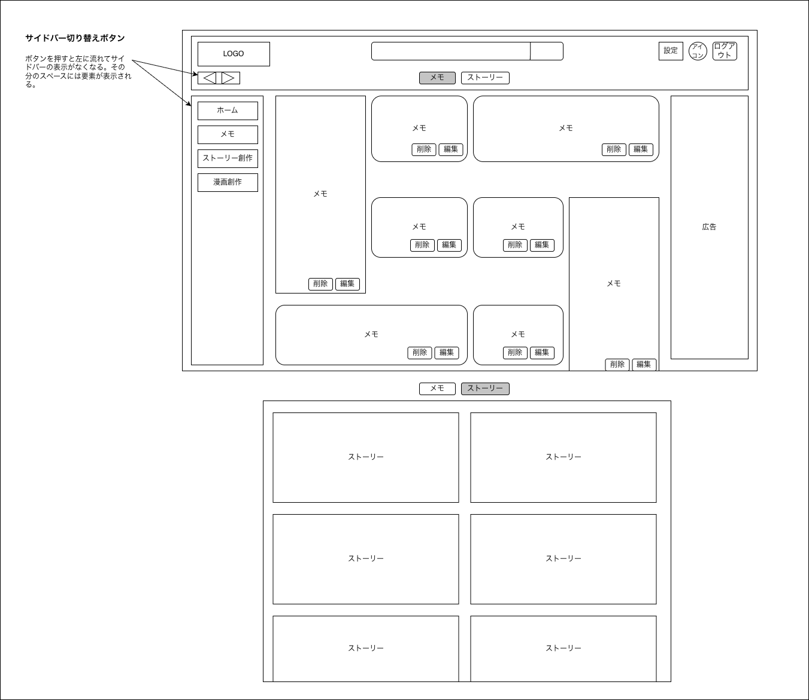

# ホーム画面

---

## 1. 画面概要

ログイン後に最初に表示される画面。
メモ・ストーリーの一覧を表示し、サイドメニューにあるボタンからはそれぞれの制作画面に遷移できる。

---

## 2. 画面情報

| 項目 | 内容 |
|------|------|
| 画面ID | SCR-003 |
| 画面名 | ホーム画面 |
| URL | /home |
| 権限 | ログインユーザー |
| 遷移元 | ログイン画面、ユーザー新規登録画面 |
| 遷移先 | メモ管理画面、ストーリー創作画面、漫画創作画面 |

---

## 3. 画面レイアウト

| No | 項目 | 説明 |
|----|------|------|
| 1 | ヘッダー | サービス名ロゴ、検索バー、表示内容変更ボタン、設定ボタン、アカウントボタン、ログアウトボタンを表示 |
| 2 | サイドメニュー | 各画面へ遷移するためのボタンを表示 |
| 3 | コンテンツエリア | 登録済みメモ・ストーリーを表示（ボタンによって切り替えられる） |
| 4 | 広告エリア | 自動でスクロールされる広告を表示 |

---

## 4. 操作

| 操作 | 動作 |
|------|------|
| ロゴをクリック | ホーム画面を再読み込みする |
| 設定をクリック | 設定編集画面を開く |
| アカウントアイコンをクリック | アカウント情報編集画面を開く |
| ログアウトをクリック | ログイン画面へ遷移 |
| 検索バーに入力・検索ボタンをクリック | 検索条件に一致するメモおよびストーリーを表示する。 |
| ホームをクリック | ホーム画面を開く |
| メモをクリック | メモ編集画面を開く |
| ストーリー創作をクリック | ストーリー創作画面を開く |
| 漫画創作をクリック | 漫画創作画面を開く |

---

## 5. 表示内容

- メモを更新日時の降順で表示する。
- ストーリーを更新日時の降順で表示する。
- 広告を一定時間ごとに自動スクロール表示する。

---

## 6. エラー

- 一覧取得に失敗した場合はエラーメッセージを表示する。
- 通信エラーが発生した場合は再読み込みを促すメッセージを表示する。

---

## 7. 備考

- ログインユーザーのデータのみ表示する。
