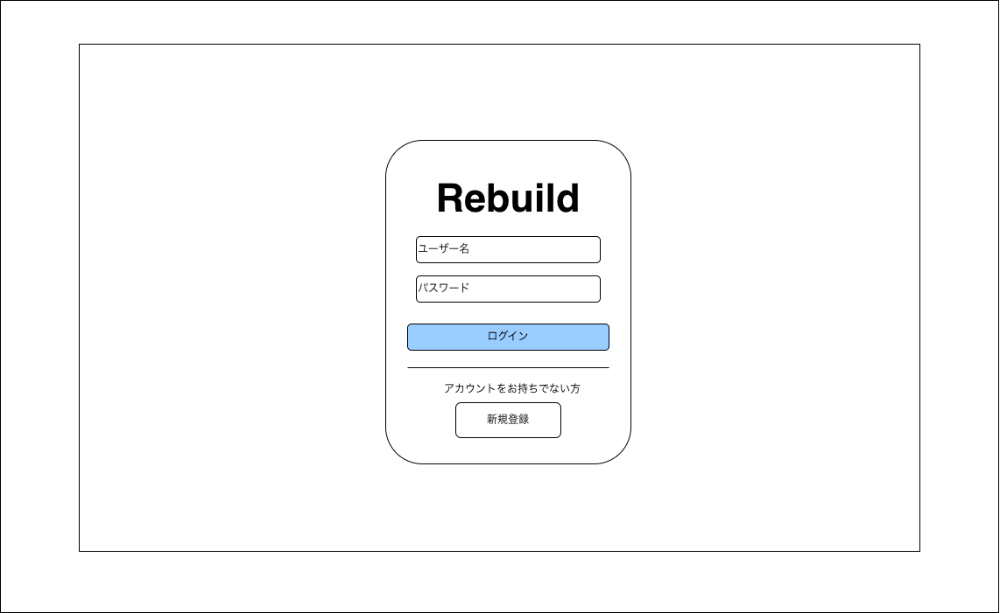

# ログイン画面

---

## 1. 画面概要

サービス利用開始時に最初に表示される画面。
ユーザー名とパスワードを入力してログインする。アカウントを持たないユーザーはこの画面からユーザー登録画面へ遷移できる。

---

## 2. 画面情報

| 項目 | 内容 |
|------|------|
| 画面ID | SCR-001 |
| 画面名 | ログイン画面 |
| URL | /login |
| 権限 | 未ログインユーザー |
| 遷移元 | （初回アクセス）、各画面でのログアウト操作 |
| 遷移先 | ホーム画面、ユーザー登録画面 |

---

## 3. 画面レイアウト

| No | 項目 | 説明 |
|----|------|------|
| 1 | サービスロゴ | サービス名（Rebuild）を表示 |
| 2 | ユーザー名入力欄 | ログインに使用するユーザー名を入力する |
| 3 | パスワード入力欄 | ログインに使用するパスワードを入力する |
| 4 | ログインボタン | 入力内容でログイン処理を実行する |
| 5 | 新規登録導線 | アカウントを持たないユーザー向けの案内文と新規登録ボタンを表示 |

---

## 4. 操作

| 操作 | 動作 |
|------|------|
| ユーザー名・パスワードを入力 | 各入力欄にカーソルを合わせ、任意の文字列を入力する |
| ログインボタンをクリック | 入力内容で認証を行い、成功時はホーム画面へ遷移する |
| 新規登録ボタンをクリック | ユーザー登録画面へ遷移する |
| パスワード入力欄でEnterキーを押下 | ログインボタン押下と同じ処理を実行する |

---

## 5. 表示内容

- ユーザー名・パスワードの入力値は初期状態では空欄とする。
- パスワード入力欄は入力内容をマスク表示する。

---

## 6. エラー

- ユーザー名またはパスワードが未入力の場合、入力を促すメッセージを表示する。
- ユーザー名またはパスワードが誤っている場合、認証に失敗した旨のメッセージを表示する（どちらが誤っているかは表示しない）。
- 通信エラーが発生した場合は再試行を促すメッセージを表示する。

---

## 7. 備考

- ログイン状態の保持（ログイン維持）の要否は別途仕様として確定する。
- パスワード再設定（パスワードを忘れた場合）の導線はワイヤーフレーム上に存在しないため、要否を別途確認する。
