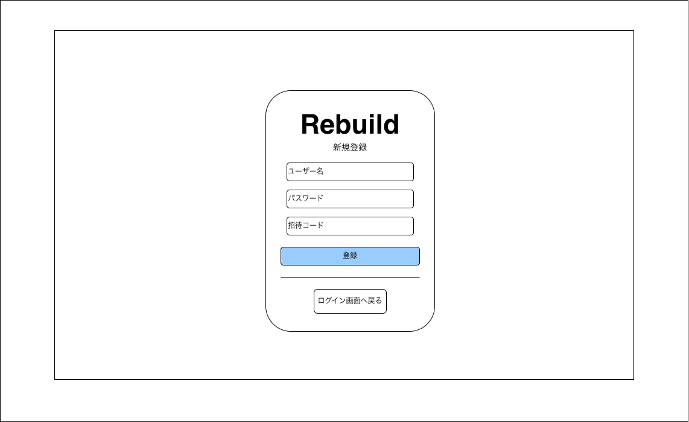

# ユーザー登録画面

---

## 1. 画面概要

新規ユーザーがアカウントを作成する画面。
ユーザー名・パスワードに加えて招待コードの入力が必須であり、招待制での新規登録を前提とする。

---

## 2. 画面情報

| 項目 | 内容 |
|------|------|
| 画面ID | SCR-002 |
| 画面名 | ユーザー登録画面 |
| URL | /register |
| 権限 | 未ログインユーザー |
| 遷移元 | ログイン画面 |
| 遷移先 | ホーム画面、ログイン画面 |

---

## 3. 画面レイアウト

| No | 項目 | 説明 |
|----|------|------|
| 1 | サービスロゴ | サービス名（Rebuild）を表示 |
| 2 | 見出し | 「新規登録」の見出しを表示 |
| 3 | ユーザー名入力欄 | 登録するユーザー名を入力する |
| 4 | パスワード入力欄 | 登録するパスワードを入力する |
| 5 | 招待コード入力欄 | サービス利用に必要な招待コードを入力する |
| 6 | 登録ボタン | 入力内容でユーザー登録処理を実行する |
| 7 | ログイン画面への導線 | 既にアカウントを持つユーザー向けの戻るボタンを表示 |

---

## 4. 操作

| 操作 | 動作 |
|------|------|
| ユーザー名・パスワード・招待コードを入力 | 各入力欄にカーソルを合わせ、任意の文字列を入力する |
| 登録ボタンをクリック | 入力内容でユーザー登録処理を実行し、成功時はホーム画面へ遷移する |
| 「ログイン画面へ戻る」ボタンをクリック | ログイン画面へ遷移する |

---

## 5. 表示内容

- ユーザー名・パスワード・招待コードの入力値は初期状態では空欄とする。
- パスワード入力欄は入力内容をマスク表示する。

---

## 6. エラー

- いずれかの項目が未入力の場合、入力を促すメッセージを表示する。
- ユーザー名が既に使用されている場合、その旨のメッセージを表示する。
- 招待コードが無効または期限切れの場合、その旨のメッセージを表示する。
- パスワードが強度要件を満たさない場合、その旨のメッセージを表示する（要件は別途バリデーション仕様に従う）。
- 通信エラーが発生した場合は再試行を促すメッセージを表示する。

---

## 7. 備考

- 招待コードの発行方法・有効期限・1コードあたりの使用可能回数は別途仕様として確定する。
- 登録直後にログイン状態となるか、ログイン画面へ誘導するかはワイヤーフレーム上「ホーム画面へ遷移」を前提としているが、要件側と整合を確認する。
