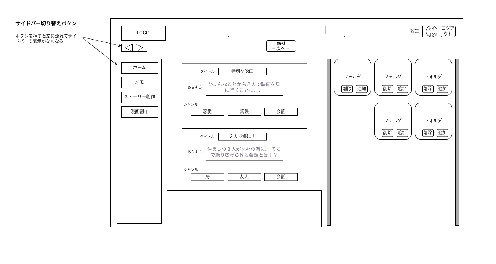

# 漫画作成 - ストーリー選択画面

---

## 1. 画面概要

漫画作成の最初のステップとして、漫画化するストーリーと使用するイラスト素材フォルダを選択する画面。
選択後に「次へ」ボタンを押下することで、漫画作成 - 編集画面へ進む。

---

## 2. 画面情報

| 項目 | 内容 |
|------|------|
| 画面ID | SCR-006 |
| 画面名 | 漫画作成 - ストーリー選択画面 |
| URL | /manga/select |
| 権限 | ログインユーザー |
| 遷移元 | ホーム画面、メモ管理画面、ストーリー管理画面 |
| 遷移先 | 漫画作成 - 編集画面、ホーム画面、メモ管理画面、ストーリー管理画面、設定画面、アカウント情報編集画面、ログイン画面（ログアウト時） |

---

## 3. 画面レイアウト

| No | 項目 | 説明 |
|----|------|------|
| 1 | ヘッダー | サービス名ロゴ、サイドバー切り替えボタン、検索バー、次へボタン、設定ボタン、アカウントボタン、ログアウトボタンを表示 |
| 2 | サイドメニュー | 各画面へ遷移するためのボタンを表示（切り替えボタンで表示・非表示を切り替え可能） |
| 3 | ストーリー一覧エリア | 登録済みストーリーをタイトル・あらすじ・ジャンル付きのカード形式で一覧表示し、1件選択できる |
| 4 | 素材フォルダ一覧エリア | イラスト素材フォルダをカード形式で一覧表示し、選択・追加・削除ができる |

---

## 4. 操作

| 操作 | 動作 |
|------|------|
| ストーリーカードをクリック | 該当ストーリーを選択状態にする |
| フォルダカードをクリック | 該当フォルダを選択状態にする |
| フォルダの追加ボタンをクリック | 新規の素材フォルダを作成する |
| フォルダの削除ボタンをクリック | 該当フォルダを削除する（削除前に確認ダイアログを表示） |
| 検索バーに入力・検索ボタンをクリック | 検索条件に一致するストーリーを表示する |
| 次へボタンをクリック | 選択したストーリー・フォルダを確定し、漫画作成 - 編集画面へ遷移する |

---

## 5. 表示内容

- ストーリーは更新日時の降順で表示する。
- フォルダは作成日時の降順で表示する。
- 次へボタンは、ストーリーが選択されるまで非活性とする。

---

## 6. エラー

- ストーリーが未選択の状態で次へボタンが押された場合、選択を促すメッセージを表示する。
- フォルダの削除に失敗した場合はエラーメッセージを表示する。

---

## 7. 備考

- ストーリー・フォルダともに複数選択が可能かどうかは、本ワイヤーフレームでは1件選択を前提としているが、別途要件を確認する。
- 素材フォルダが1件も存在しない場合の挙動（作成を促す等）は別途確定する。
