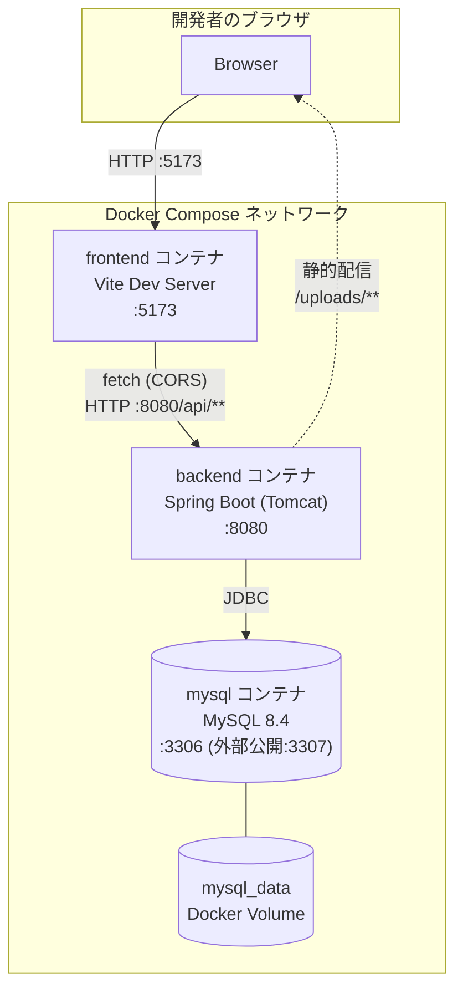
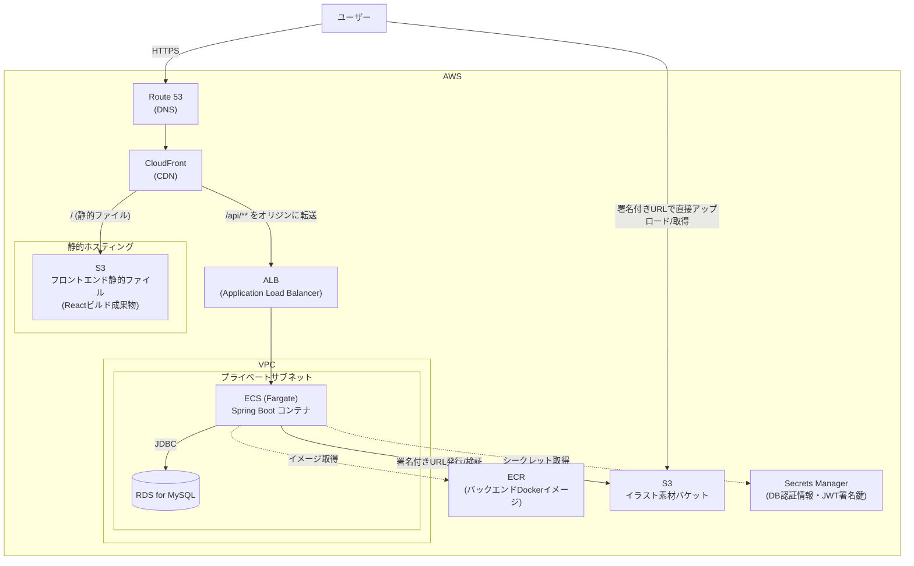
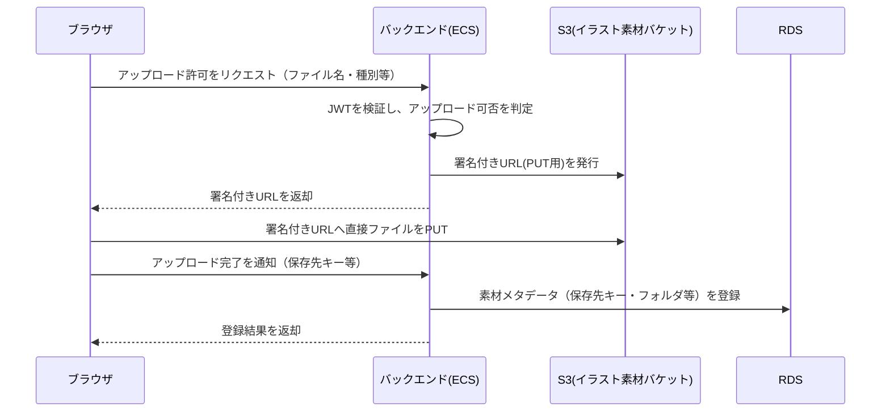

# システム構成図

02-screen-designの画面遷移図が`.drawio`形式であるのに対し、本ファイルはMermaid記法で構成図を記述している（この環境ではdrawioの編集アプリを直接操作できないため）。GitHubやVS Code（Mermaidプラグイン導入時）ではそのまま図として表示される。drawio形式への統一が必要であれば、本ファイルの内容をベースに作成できる。

---

## 1. 開発環境構成（現状）

`compose.yml`で定義されている、現在ローカルで動かしている構成。

- フロントエンドとバックエンドは別コンテナ・別オリジンで動作し、`@CrossOrigin`によるCORS許可で通信している（Cookieは使用しない）。
- プロフィール画像はバックエンドコンテナのローカルファイルシステム（`uploads/`）に保存され、`/uploads/**`として配信される。
- DBの永続化はDocker Volume（`mysql_data`）で行っている。

---

## 2. 本番目標構成（AWS）

「実際のWebアプリと遜色ないレベル」を目標に想定する構成。ユーザーからの要望に基づき、S3 + CloudFront + ALB + ECS + RDSを中心に設計する。

### 構成のポイント

| 項目 | 内容 |
|---|---|
| フロントエンド配信 | CloudFront経由でS3の静的ファイルを配信し、CDNキャッシュで高速化する |
| API通信 | CloudFrontで`/api/**`パスをALBにルーティングし、単一ドメイン配下でフロント・APIを配信する（CORS設定を簡素化できる） |
| バックエンド実行 | ECS（Fargate）でSpring Bootコンテナを実行。ECRに登録したDockerイメージ（現状の`RebuildJava/Dockerfile`）をそのまま利用できる |
| データベース | RDS for MySQL。可用性（Multi-AZ）やバックアップ方針は04-database以降で詳細化する |
| イラスト素材アップロード | バックエンドが発行するS3署名付きURL（presigned URL）を使い、ブラウザからS3へ直接アップロードする方式を想定（バックエンドを経由しないため大容量ファイルでもサーバー負荷が小さい） |
| ネットワーク | ECS・RDSはプライベートサブネットに配置し、インターネットからの直接アクセスを避ける（ALB経由のみ） |
| シークレット管理 | DB接続情報・JWT署名鍵はSecrets Managerで管理し、環境変数や設定ファイルへの平文記載を避ける |

---

## 3. イラスト素材アップロードのシーケンス（本番目標構成における想定）

S3への直接アップロード方式（presigned URL方式）の処理の流れ。詳細なAPI仕様は05-apiで定義する。

---

## 作成情報

| 項目 | 内容 |
|------|------|
| 工程名 | システム設計 |
| 最終更新日 | 2026-08-18 |
| 更新者 | Ren Nakamoto |
