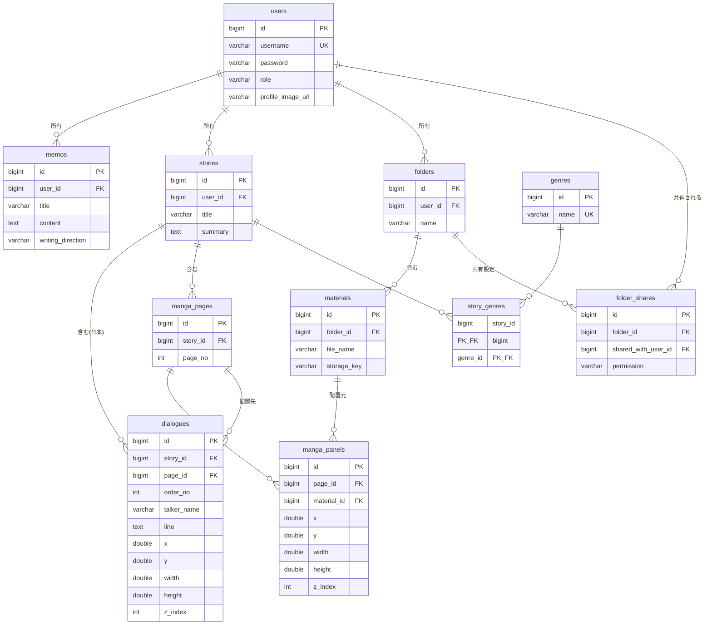

# ER図

03-system-designの構成図と同様、drawioの編集アプリを直接操作できないためMermaid記法で記述する。各カラムの型・制約の詳細は[table-definitions.md](../table-definitions.md)を参照。

---

## 全体ER図

---

## 補足

- `story_genres`は`stories`と`genres`の多対多を表す中間テーブル。1ストーリーあたり最大3件までという制約はアプリケーション側で担保し、DB制約としては設けない（[table-definitions.md](../table-definitions.md)参照）。
- `manga_pages`は漫画の「ページ」を表す新設テーブル。`manga_panels`（イラストの配置）と`dialogues`（セリフの配置）は、いずれも`page_id`で特定のページに紐づく。
- `dialogues`は、ストーリー作成段階（[StoryCreate](../02-screen-design/specifications/StoryCreate.md)）では台本として`story_id`のみに紐づき、漫画編集段階（[CreateManga](../02-screen-design/specifications/CreateManga.md)）で`page_id`と座標が確定する2段階の運用を想定している。同一セリフの使い回しは想定しないため、イラスト素材のような「マスタ＋配置」分離はせず、座標カラムを直接持たせている。
- `folder_shares`は現時点でUI・APIが存在しない将来拡張用のテーブル。03-system-designでの合意（将来的な素材の共有・コラボ機能を見据える）を受けて、フォルダ単位での共有を表現できるように用意した。
- `manga_panels.material_id`は`materials`への外部キー。現行実装（`image_src`に文字列パスを直接持つ方式）からの変更点であり、詳細は[table-definitions.md](../table-definitions.md#現行実装との差分マイグレーション時の申し送り)を参照。

---

## 作成情報

| 項目 | 内容 |
|------|------|
| 工程名 | データベース設計 |
| 最終更新日 | 2026-08-18 |
| 更新者 | Ren Nakamoto |
